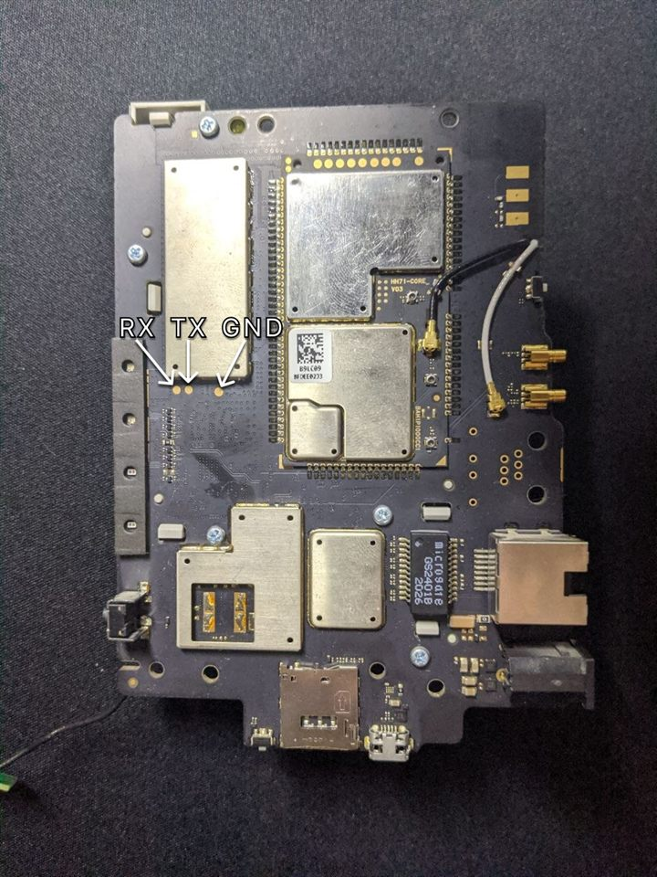

# Run the HH71VM test build from RAM

This guide covers the only public deployment path supported by this repository: loading the
`nfjrom` image into RAM through the Realtek bootloader.

On the reference HH71VM, this procedure did not write the Realtek SPI flash. The image runs
until power is removed. Do not substitute another image or bootloader command.

## Before you begin

You need:

| Item | Requirement |
|---|---|
| USB-to-UART adapter | **3.3 V logic levels**; never use 5 V |
| UART wiring | RX, TX, and GND only; do not connect adapter power |
| Ethernet cable | Router LAN port directly to the test computer |
| Python | Python 3; the tool was tested with Python 3.9 |
| Python package | `pyserial`, installed from `tools/requirements.txt` |
| Image | `firmware/openwrt-rtkmipsel-rtl8197f-hh71vm-nfjrom.bin` |

You must open the enclosure. Use the labelled photo below for the Realtek-side UART
connection. Visually confirm the board orientation before connecting anything.

<details>
<summary>Show the Realtek UART pinout photo</summary>



</details>

The loader does not use the stock web interface, Telnet, SSH, or any stock `root` password.
It talks only to the Realtek bootloader over UART and transfers the RAM image over TFTP.

> [!WARNING]
> The HH71VM contains separate Realtek and Qualcomm systems. Use the Realtek UART. If the
> console output is about the Qualcomm modem, stop and recheck the connection.

## 1. Download and verify the repository

Clone the repository:

```text
git clone https://github.com/sowarden/hh71vm-openwrt-experimental.git
cd hh71vm-openwrt-experimental
```

Alternatively, use GitHub's **Code → Download ZIP**, extract it, and open a terminal in the
extracted directory.

Verify the image before connecting the router.

Windows PowerShell:

```powershell
Get-FileHash -Algorithm SHA256 firmware\openwrt-rtkmipsel-rtl8197f-hh71vm-nfjrom.bin
```

Linux or macOS:

```sh
cd firmware
sha256sum -c SHA256SUMS
cd ..
```

Expected SHA-256:

```text
4d4a329edbe034e431a12f4f57aa8c46c4f4fe51a4d1d161a852b6a9134691f7
```

Stop if the checksum differs.

## 2. Install the Python dependency

Windows:

```text
python -m pip install -r tools/requirements.txt
```

Linux or macOS:

```text
python3 -m pip install -r tools/requirements.txt
```

No external TFTP server is required; the RAM boot tool contains the required TFTP client.

## 3. Connect the UART

With the router powered off, connect:

- adapter TX to router RX;
- adapter RX to router TX;
- adapter GND to router GND.

Do **not** connect the adapter's VCC/5 V/3.3 V power pin. Power the router with its normal
power supply.

Serial settings are `38400 baud`, `8 data bits`, `no parity`, `1 stop bit` (`38400 8N1`).

Find the serial device name:

- Windows: **Device Manager → Ports (COM & LPT)**, for example `COM8`;
- Linux: usually `/dev/ttyUSB0` or `/dev/ttyACM0`;
- macOS: usually `/dev/tty.usbserial-*`.

On Linux, serial access may require membership in the `dialout` group. Log out and back in
after changing group membership.

## 4. Configure the computer's Ethernet interface

Connect the computer directly to the router's LAN port and set a static IPv4 address:

```text
Address: 192.168.1.50
Mask:    255.255.255.0
Gateway: 192.168.1.1
DNS:     leave empty
```

The gateway does not interfere with the bootloader transfer and allows the computer to use
the router for routed Internet access after OpenWrt starts. DNS may remain empty for the RAM
transfer itself.

Disable or disconnect other interfaces using `192.168.1.0/24` to avoid routing the TFTP
traffic to the wrong adapter. During transfer, the bootloader uses `192.168.1.6`; OpenWrt
uses `192.168.1.1` after boot.

## 5. Enter the Realtek bootloader

1. Open a serial terminal at `38400 8N1`.
2. Disconnect router power.
3. Hold the WPS button.
4. Apply power while continuing to hold WPS.
5. Release WPS when the console stops at the prompt:

   ```text
   <RealTek>
   ```

On the reference unit, the useful hold time was roughly 10–12 seconds, but use the prompt,
not the stopwatch, as the success criterion. If a short line of unreadable characters is
shown, press Enter once. If normal boot continues, power off and try again.

Do not enter any flash commands.

## 6. Start the RAM image

Close the serial terminal completely; only one program can own the port. From the repository
root, run the command below and replace `COM8` with your actual port:

```text
python tools/ram_boot.py firmware/openwrt-rtkmipsel-rtl8197f-hh71vm-nfjrom.bin --port COM8
```

Linux or macOS example:

```text
python3 tools/ram_boot.py firmware/openwrt-rtkmipsel-rtl8197f-hh71vm-nfjrom.bin --port /dev/ttyUSB0
```

Do not rename the image. The verified bootloader path selects RAM execution from the
`nfjrom` substring in the transferred filename. The tool also sends `AUTOBURN 0` and exposes
no flash-write command.

The complete serial session is saved automatically under `tools/ram-boot-logs/`. Keep this
file even when boot succeeds.

Expected milestones include:

```text
Jump to 0x84000000
procd: - init -
Please press Enter to activate this console.
```

If your output differs, do not start guessing bootloader commands. Save the log and report
the exact last line reached.

## 7. Connect to OpenWrt

Ethernet:

```text
ping 192.168.1.1
ssh -o HostKeyAlgorithms=+ssh-rsa root@192.168.1.1
```

The image initially has no root password. Modern OpenSSH clients need the explicit legacy
host-key option shown above.

LuCI:

```text
http://192.168.1.1/
```

Default Wi-Fi:

| Band | SSID | Password |
|---|---|---|
| 2.4 GHz | `HH71VM` | `hh71vm12345` |
| 5 GHz | `HH71VM-5G` | `hh71vm12345` |

Set a temporary root password in LuCI before connecting untrusted clients. OpenWrt-side
changes disappear when this RAM image is power-cycled.

> [!CAUTION]
> The modem pages control the separate Qualcomm subsystem. Changes to SIM, APN, or network
> mode may persist on that subsystem and are not guaranteed to be undone by rebooting the
> Realtek side. Change modem settings only when intentionally testing them and record the
> original values first.

## Return to the installed firmware

Disconnect power, wait a few seconds, then power on normally without holding WPS. On the
reference unit, this returned to the firmware already stored in flash.

## Troubleshooting

### No `<RealTek>` prompt

Confirm the Realtek UART, 3.3 V levels, RX/TX orientation, common ground, and `38400 8N1`.
Try a slightly shorter or longer WPS hold.

### Serial port is busy or access is denied

Close PuTTY and every other serial program. On Linux, verify permissions for the serial
device and membership in `dialout`.

### `ModuleNotFoundError: No module named 'serial'`

Install the dependency through the same interpreter used to run the tool:

```text
python -m pip install -r tools/requirements.txt
```

Use `python3` instead of `python` where required.

### TFTP does not start

Verify `192.168.1.50/24`, the direct LAN cable, and that no other adapter owns
`192.168.1.0/24`. Allow inbound UDP for the Python interpreter in the host firewall.

### OpenWrt boots but networking does not work

This is a high-value compatibility result. Keep the complete UART log and submit a hardware
compatibility report. Do not hide early boot warnings.

### SSH reports a changed host key

RAM boots can generate a different SSH host key. Remove only this host's stale entry:

```text
ssh-keygen -R 192.168.1.1
```

Do not delete the entire `known_hosts` file.

### LuCI shows `Bad Request` or another unexpected page

The browser may still have the vendor web interface cached for `192.168.1.1`. Reload the
page with F5. If the problem remains, use a hard reload, clear the browser cache/site data
for `192.168.1.1`, or open `http://192.168.1.1/` in a private window.
